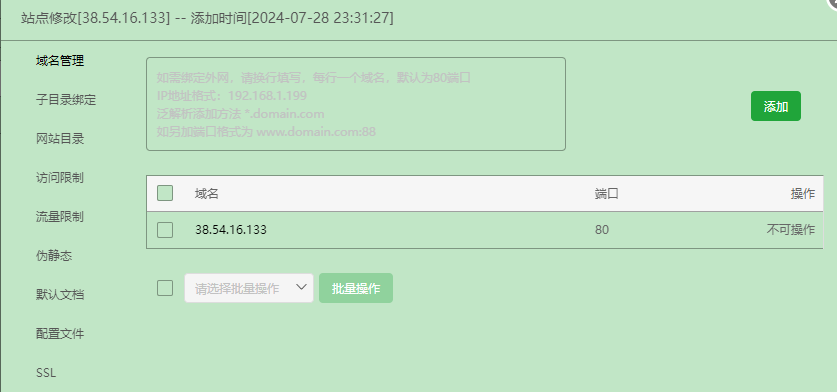
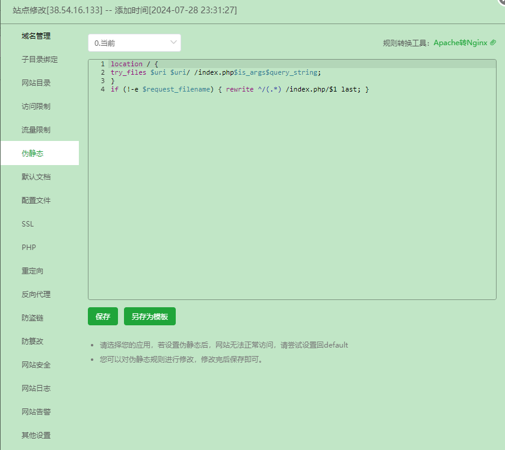
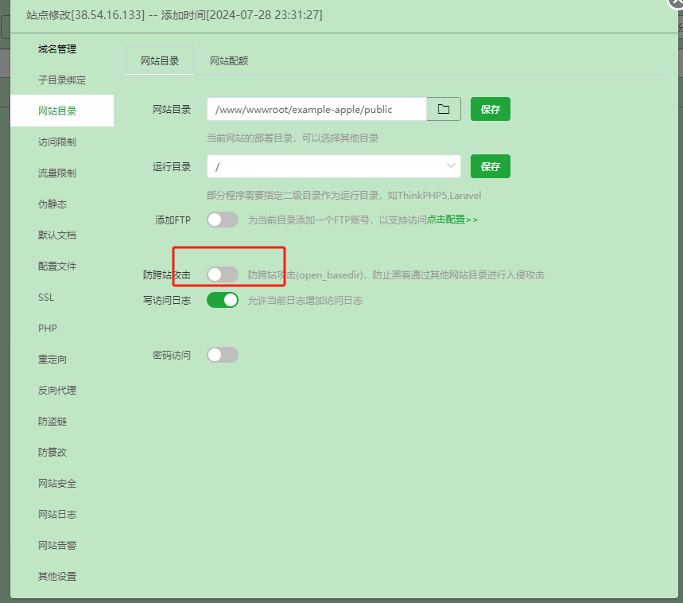

### install 
在 宝塔中安装 docker 容器
#### 安装扩展包
docker run --rm \
-u "$(id -u):$(id -g)" \
-v "$(pwd):/var/www/html" \
-w /var/www/html \
laravelsail/php83-composer:latest \
composer install --ignore-platform-reqs

#### 修改配置 .env 文件

cp .env.example .env


1. 修改数据库配置

执行命令  ```vi .env``` 

修改 .env 文件中数据库配置，，APP_URL 设置为你的域名 APP_ENV 设置为 production
```bash
DB_CONNECTION=mysql
DB_HOST=mysql
DB_PORT=3306
DB_DATABASE=laravel
DB_USERNAME=sail
DB_PASSWORD=123456 
```

2. 修改 redis 配置

```bash
REDIS_CLIENT=phpredis
REDIS_HOST=redis
REDIS_PASSWORD=null
REDIS_PORT=6379
```
3. 修改队列配置
```bash
QUEUE_CONNECTION=redis
```

### 配置域名

执行命令 cp nginx.conf.example nginx.conf
1. 将 server_name 修改为 项目解析域名, 
2. 修改 root 为容器中项目根目录（一般需要修改）
```bash
server {
    listen 80;
    server_name your_domain.com;
    root /var/www/html/public;

    index index.php;

    location / {
        try_files $uri $uri/ /index.php?$query_string;
    }

    location ~ \.php$ {
        fastcgi_pass laravel.test:9000;
        fastcgi_index index.php;
        include fastcgi_params;
        fastcgi_param SCRIPT_FILENAME $document_root$fastcgi_script_name;
    }

    location ~ /\.(?!well-known).* {
        deny all;
    }
}
```
### 配置 supervisord
修改 supervisord.conf 文件, 将 horizon 设置为守护进程，并设置日志文件，一般不需要修改
```bash
[program:horizon]
command=php /var/www/html/artisan horizon
autostart=true
autorestart=true
redirect_stderr=true
stdout_logfile=/var/www/html/storage/logs/horizon.log
stopwaitsecs=3600
```


### 启动项目
####  运行容器 docker-compose up -d --build 

#### 进入容器
docker-compose exec laravel.test bash 

#### 生成 key
php artisan key:generate
#### 创建数据库
php artisan migrate
#### 创建管理员账号
php artisan make:filament-user


### 修改文件权限
请替换成你的项目地址
chown -R www-data:www-data /var/www/html
chmod -R 755 /var/www/html/storage


#### 验证队列是否执行：
php artisan horizon:status

#### 后台地址 http://your_domain/admin/

请将 your_domain 替换成你的域名


### 使用宝塔面板安装

###  在应用商店安装 mysql
####  创建数据库并记录数据库用户名和密码

### 在应用商店安装 php8.3

#### 1.1安装 PHP 扩展
```bash
php -m
[PHP Modules]
fileinfo
opcache
memcached
redis
exif
intl
mbstring	
calendar
sysvmsg
igbinary

[Zend Modules]
Xdebug
Zend OPcache
```
####  1.2 修改禁用函数
```bash
proc_open
pcntl_signal
```

### 2. 安装 redis

### 4 安装 nginx

### 5 安装 superdvisord

### 修改项目配置
#### 1.3 修改 .env 文件
在 .env 文件中配置数据库
```bash
DB_CONNECTION=mysql
DB_HOST=127.0.0.1
DB_PORT=3306
DB_DATABASE=laravel #替换成你的数据库名称
DB_USERNAME=sail #替换成你的数据库用户名
DB_PASSWORD=123456 #替换成你的数据库密码
```
在 .env 文件中配置 redis
```bash
REDIS_CLIENT=phpredis
REDIS_HOST=127.0.0.1 #替换成你的redis地址 一般是 127.0.0.1
REDIS_PASSWORD=null #替换成你的redis密码
REDIS_PORT=6379
```
在 .env 文件中配置队列
```bash
QUEUE_CONNECTION=redis
```

在 .env 文件中配置域名
```bash
APP_URL=http://local.apple.com #替换成你的域名
```

### 创建站点信息
#### 配置域名


#### 配置伪静态
```bash
location / {
try_files $uri $uri/ /index.php$is_args$query_string;
}
if (!-e $request_filename) { rewrite ^/(.*) /index.php/$1 last; }
```


#### 配置网站目录
注意关闭防跨站攻击



