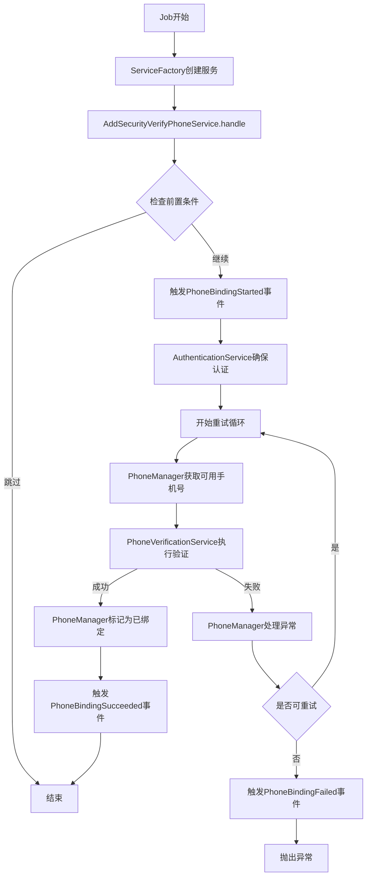

# 优化后的手机号绑定 OOP 架构文档

## 概述

本文档描述了完全重构后的 Apple ID 手机号绑定系统，采用了现代的 OOP 设计模式，包括依赖注入、单一职责原则、工厂模式等，实现了高度的可扩展性、可测试性和可维护性。

## 核心设计原则

### 1. 单一职责原则 (SRP)

每个类都有明确的单一职责：

-   `PhoneManager`: 专门处理手机号管理
-   `BlacklistManager`: 专门处理黑名单逻辑
-   `AuthenticationService`: 专门处理认证逻辑
-   `PhoneVerificationService`: 专门处理验证流程
-   `AddSecurityVerifyPhoneService`: 协调整个绑定流程

### 2. 依赖注入 (DI)

通过构造函数注入依赖，提高可测试性：

```php
public function __construct(
    private readonly Account $account,
    private readonly PhoneManager $phoneManager,
    private readonly AuthenticationService $authService
) {}
```

### 3. 工厂模式

使用工厂简化服务创建：

```php
$service = PhoneBindingServiceFactory::create($account);
```

## 架构组件详解

### 核心服务层

#### 1. PhoneManager

**职责**: 手机号生命周期管理

-   获取可用手机号
-   管理手机号状态
-   处理手机号异常
-   维护排除列表

**关键方法**:

```php
public function getAvailablePhone(): Phone
public function markPhoneAsBound(Phone $phone): void
public function handlePhoneException(Phone $phone, Throwable $exception): void
```

#### 2. BlacklistManager

**职责**: 黑名单管理

-   添加/移除黑名单
-   检查黑名单状态
-   自动过期清理
-   统计信息

**关键方法**:

```php
public function addToBlacklist(int $phoneId): void
public function isInBlacklist(int $phoneId): bool
public function getActiveBlacklistIds(): array
```

#### 3. AuthenticationService

**职责**: 认证管理

-   确保认证有效
-   刷新认证 token
-   验证账号状态
-   获取认证状态

**关键方法**:

```php
public function ensureAuthenticated(Account $account): void
public function refreshAuthentication(Account $account): void
public function isAccountValid(Account $account): bool
```

#### 4. PhoneVerificationService

**职责**: 手机验证流程

-   初始化验证
-   创建验证请求
-   完成验证码验证
-   提交验证结果

**关键方法**:

```php
public function verify(Phone $phone): SecurityVerifyPhone
```

#### 5. AddSecurityVerifyPhoneService

**职责**: 流程协调

-   检查前置条件
-   协调各个服务
-   处理重试逻辑
-   触发事件

### 支持层

#### 6. PhoneBindingServiceFactory

**职责**: 服务创建工厂

-   简化服务实例化
-   统一依赖管理
-   批量服务创建

#### 7. PhoneBindingServiceProvider

**职责**: 依赖注入配置

-   注册服务依赖关系
-   配置单例/实例
-   管理服务生命周期

## 数据流图



## 事件系统

### 事件类型

1. **PhoneBindingStarted**: 绑定开始
2. **PhoneBindingSucceeded**: 绑定成功
3. **PhoneBindingFailed**: 绑定失败

### 事件监听器

1. **LogPhoneBindingStarted**: 记录开始日志，更新状态
2. **LogPhoneBindingSucceeded**: 记录成功日志，更新状态
3. **LogPhoneBindingFailed**: 记录失败日志，更新状态
4. **SendPhoneBindingNotification**: 发送通知

## 配置示例

### 服务提供者注册

```php
// config/app.php
'providers' => [
    // ...
    App\Providers\PhoneBindingServiceProvider::class,
],
```

### 使用示例

```php
// 在Job中使用
$service = PhoneBindingServiceFactory::create($account);
$service->handle();

// 在其他地方使用单个服务
$phoneManager = PhoneBindingServiceFactory::createPhoneManager();
$blacklistManager = PhoneBindingServiceFactory::createBlacklistManager();
```

## 测试策略

### 单元测试

每个服务都可以独立测试：

```php
public function test_phone_manager_gets_available_phone()
{
    $blacklistManager = $this->mock(BlacklistManager::class);
    $phoneManager = new PhoneManager($blacklistManager);

    // 测试逻辑...
}
```

### 集成测试

```php
public function test_complete_binding_flow()
{
    $services = PhoneBindingServiceFactory::createAll($account);
    // 测试完整流程...
}
```

### Mock 示例

```php
$this->mock(PhoneManager::class)
    ->shouldReceive('getAvailablePhone')
    ->once()
    ->andReturn($phone);
```

## 性能优化

### 1. 单例模式

对于无状态服务使用单例：

```php
$this->app->singleton(BlacklistManager::class);
```

### 2. 懒加载

按需创建服务实例：

```php
$this->app->bind(PhoneVerificationService::class, function($app, $parameters) {
    // 只在需要时创建
});
```

### 3. 缓存策略

在 BlacklistManager 中使用 Redis 缓存：

```php
private function isExpired(int $timestamp): bool
{
    return (now()->timestamp - $timestamp) >= self::EXPIRE_SECONDS;
}
```

## 扩展性设计

### 1. 新增手机号提供商

实现新的手机号获取策略：

```php
interface PhoneProviderInterface
{
    public function getAvailablePhones(): Collection;
}

class NewPhoneProvider implements PhoneProviderInterface
{
    // 实现逻辑
}
```

### 2. 新增验证方式

扩展验证服务：

```php
interface VerificationStrategyInterface
{
    public function verify(Phone $phone): bool;
}
```

### 3. 新增事件监听器

添加新的业务逻辑：

```php
class CustomPhoneBindingListener
{
    public function handle(PhoneBindingSucceeded $event)
    {
        // 自定义逻辑
    }
}
```

## 监控和调试

### 1. 日志记录

结构化日志记录：

```php
Log::info('Phone binding process', [
    'account_id' => $account->id,
    'phone_id' => $phone->id,
    'attempt' => $attempt,
    'service' => static::class,
]);
```

### 2. 性能监控

```php
$startTime = microtime(true);
// 业务逻辑
$duration = microtime(true) - $startTime;
Log::info('Service performance', ['duration' => $duration]);
```

### 3. 错误追踪

```php
try {
    // 业务逻辑
} catch (Throwable $e) {
    Log::error('Service error', [
        'exception' => $e->getMessage(),
        'trace' => $e->getTraceAsString(),
        'context' => $this->getContext(),
    ]);
    throw $e;
}
```

## 部署检查清单

1. ✅ 确保所有服务提供者已注册
2. ✅ 验证依赖注入配置正确
3. ✅ 检查事件监听器注册
4. ✅ 确认 Redis 连接配置
5. ✅ 验证队列系统正常
6. ✅ 检查日志权限和存储
7. ✅ 运行完整测试套件
8. ✅ 验证监控系统正常

## 总结

优化后的架构具有以下优势：

1. **高度模块化**: 每个组件职责单一，易于理解和维护
2. **强类型安全**: 使用依赖注入和接口约束
3. **易于测试**: 所有依赖都可以轻松模拟
4. **高可扩展性**: 新功能可以通过添加新服务或监听器实现
5. **性能优化**: 合理使用单例和懒加载
6. **易于调试**: 完善的日志记录和错误处理

这个架构为未来的功能扩展和维护奠定了坚实的基础。
