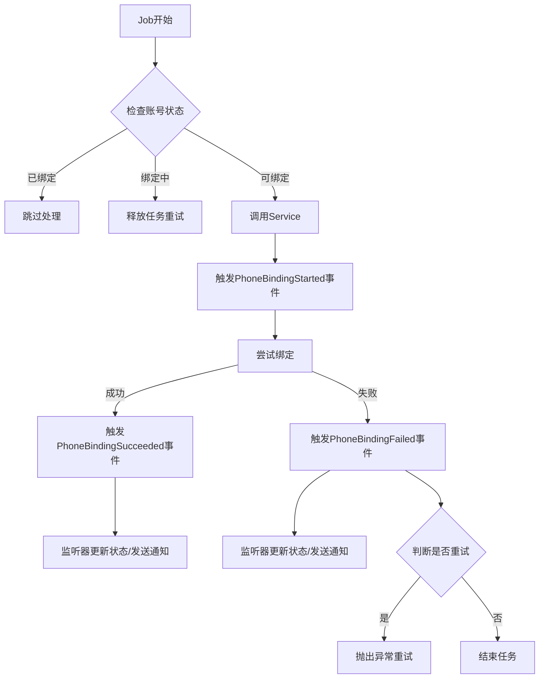

# 手机号绑定架构文档

## 概述

本文档描述了重构后的 Apple ID 手机号绑定系统的架构设计，采用事件驱动架构实现了职责分离和高度可测试性。

## 架构组件

### 1. 事件系统 (Events)

#### PhoneBindingStarted

-   **触发时机**: 开始绑定手机号时
-   **包含数据**: Account 对象、尝试次数
-   **作用**: 通知系统开始绑定流程

#### PhoneBindingSucceeded

-   **触发时机**: 手机号绑定成功时
-   **包含数据**: Account 对象、Phone 对象、尝试次数
-   **作用**: 通知系统绑定成功

#### PhoneBindingFailed

-   **触发时机**: 手机号绑定失败时
-   **包含数据**: Account 对象、异常信息、尝试次数、Phone 对象(可选)
-   **作用**: 通知系统绑定失败

### 2. 事件监听器 (Listeners)

#### LogPhoneBindingStarted

-   **职责**: 更新账号状态为绑定中，记录开始日志
-   **触发事件**: PhoneBindingStarted

#### LogPhoneBindingSucceeded

-   **职责**: 更新账号状态和绑定信息，记录成功日志
-   **触发事件**: PhoneBindingSucceeded

#### LogPhoneBindingFailed

-   **职责**: 根据异常类型更新账号状态，记录失败日志
-   **触发事件**: PhoneBindingFailed

#### SendPhoneBindingNotification

-   **职责**: 发送绑定成功/失败的通知
-   **触发事件**: PhoneBindingSucceeded, PhoneBindingFailed

### 3. 服务类 (Services)

#### AddSecurityVerifyPhoneService

-   **主要职责**:
    -   执行手机号绑定的核心业务逻辑
    -   触发相应的事件
    -   处理认证和验证流程
-   **不再包含**: 状态管理、日志记录、通知发送

### 4. 队列任务 (Jobs)

#### AppleidAddSecurityVerifyPhone

-   **主要职责**:
    -   控制任务的重试逻辑
    -   处理并发场景
    -   决定是否需要重试
-   **不再包含**: 状态管理、日志记录、通知发送

## 数据流



## 优势

### 1. 职责分离

-   **Job**: 专注于重试逻辑和并发控制
-   **Service**: 专注于业务逻辑
-   **Events/Listeners**: 专注于状态管理和通知

### 2. 高可测试性

-   每个组件都可以独立测试
-   事件系统可以轻松模拟和验证
-   依赖注入使模拟变得简单

### 3. 可扩展性

-   新的监听器可以轻松添加
-   事件数据可以扩展而不影响现有代码
-   业务逻辑与基础设施解耦

### 4. 可维护性

-   清晰的数据流
-   统一的事件处理机制
-   减少重复代码

## 配置

### EventServiceProvider 配置

```php
protected $listen = [
    PhoneBindingStarted::class => [
        LogPhoneBindingStarted::class,
    ],

    PhoneBindingSucceeded::class => [
        LogPhoneBindingSucceeded::class,
        SendPhoneBindingNotification::class . '@handleSucceeded',
    ],

    PhoneBindingFailed::class => [
        LogPhoneBindingFailed::class,
        SendPhoneBindingNotification::class . '@handleFailed',
    ],
];
```

## 测试策略

### 单元测试

-   **Service 测试**: 验证事件触发和业务逻辑
-   **Job 测试**: 验证重试逻辑和状态检查
-   **Listener 测试**: 验证状态更新和通知发送

### 集成测试

-   完整的绑定流程测试
-   事件传播测试
-   异常场景测试

## 监控和观察

### 关键指标

-   绑定成功率
-   平均绑定时间
-   失败原因分布
-   重试次数分布

### 日志记录

-   结构化日志记录所有关键事件
-   包含追踪 ID 便于调试
-   异常堆栈跟踪

## 部署注意事项

1. 确保事件监听器已正确注册
2. 验证队列系统正常运行
3. 监控事件处理延迟
4. 确保数据库事务正常提交
